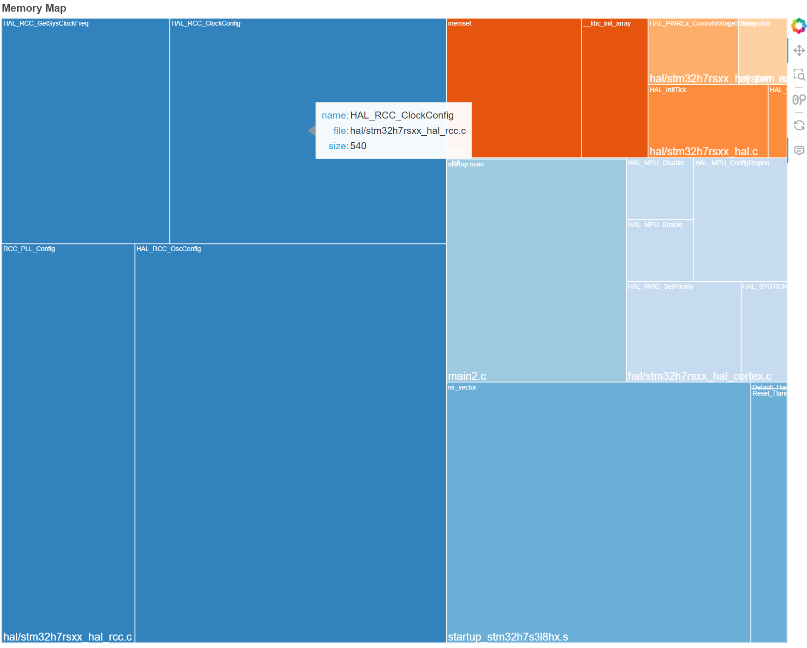

# MemViewer

MemViewer is a utility for software developers to view the memory required by
their compiled programs.  It can extract information from linker map files
or ELF files.  MemViewer then creates a simple image using the 
squarify treemap layout algorithm that gives a quick
way to inspect the memory.  You can easily filter the data to display
what matters to you.  

Here is a simple example of the output:




## Installation

Install [Python](https://www.python.org/) 3.9 or newer for your platform, 
if it is not already available

```
pip install memviewer
```


## Usage

You can either run the script directly:

```
memviewer {my_program.map} 
```

or as a Python package:

```
python -m memviewer {my_program.map} 
```

For details on the available options, provide a `--help` argument.

Here is an example:

```
python -m memviewer --address-prefix=0x08 --filename-prefix src/CMakeFiles/playground_boot.elf.dir/ --groupby source memviewer/test/example_01.map
```


## License

MemViewer is released under the permissive Apache 2.0 license.
See the [License File](LICENSE.txt) for details.

## References

* Tools used
  * [Bokeh](https://docs.bokeh.org/en/latest/index.html) 
    [example](https://docs.bokeh.org/en/latest/docs/user_guide/topics/hierarchical.html#ug-topics-hierarchical-treemap)
  * [Squarify](https://github.com/laserson/squarify)
  * [pyelftools](https://github.com/eliben/pyelftools)
* Linker map files 
  * [Buried Treasure and Map Files](https://embedded.fm/blog/mapfiles), Elecia White, 2021.
  * [Get the most out of linker map file](https://interrupt.memfault.com/blog/get-the-most-out-of-the-linker-map-file),
    Cyril Fougeray, 2019
* Other tools to consider: 
  * [LinkerScope](https://github.com/raulgotor/linkerscope) 
  * [linkermapviz](https://github.com/8bitgeek/linkermapviz)
  * [MapViewer](https://github.com/govind-mukundan/MapViewer)
  * [puncover](https://github.com/HBehrnspuncover)
  * [Emma](https://github.com/bmwcarit/Emma)
  * [amap](https://www.sikorskiy.net/info/prj/amap/index.html)
  * [GccMapVisualizer](https://github.com/jotux/GccMapVisualizer)
  * [linker-map-viewer](https://github.com/jpgvandijk/linker-map-viewer)
